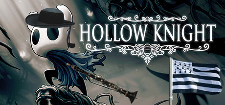

# Hollow Knight e Brezhoneg

Vous rêvez de jouer à Hollow Knight en Breton ? Je ne suis donc pas tout seul ! Vous êtes sur le bon repo !

L'installation est assez simple :
- Installez [Scarab](https://github.com/fifty-six/Scarab).
- Installez le mod "LanguageSupport"
- Dans le dossier d'installation de Hollow Knight, déplacez vous dans le dossier "hollow_knight_Data\Managed\Mods\LanguageSupport\LanguageSupport" et collez bien délicatement le dossier "BR" présent dans ce repo.
- Relancez le jeu et profitez de la traduction !

La traduction est actuellement en cours, je pars du français pour traduire en breton, donc tout ce qui n'est pas traduit est en français.